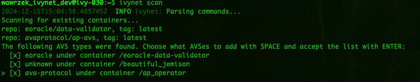
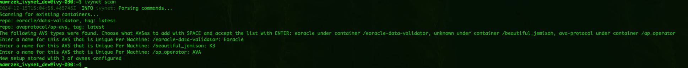
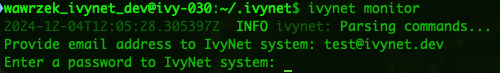
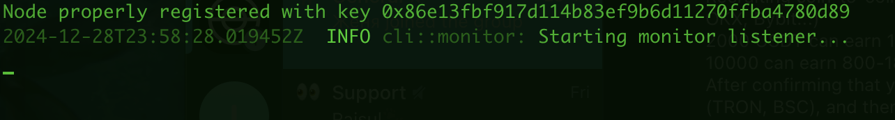
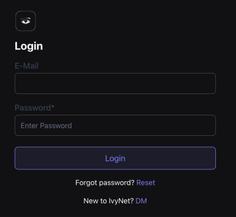
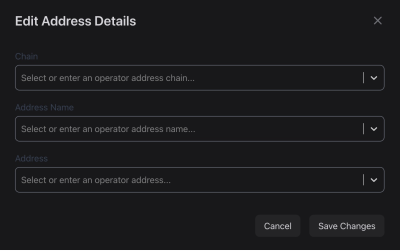

# Quickstart Guide

Contact us on [telegram](https://t.me/ivynetdotdev) if you have any questions!

## Prerequisites and dependencies

The following document assumes that:

- A contemporary Linux distribution (e.g. Debian 12, Ubuntu 24.04, RHEL 9) with libssl and libcrypto libraries is ready to use
- Docker and docker-compose (or docker compose) are installed
- User operating ivynet can control Docker, e.g. is a member of the docker group
- The user's ECDSA account has already registered as an operator on the EigenLayer network.
If not, go to the [EigenLayer site](https://docs.eigenlayer.xyz/eigenlayer/operator-guides/operator-installation).
- All AVS's are deployed with Docker
- You have obtained an ivynet username and password. If not, contact us on [telegram](https://t.me/ivynetdotdev) and we will create an organization on your behalf. This process will soon be DIY.  

## Installation

*The installation of the ivynet client, as well as Docker, can be done with the [Ansible role](https://github.com/ivy-net/ivynet-client-ansible).*

* Get the latest binary file from the [cloud bucket](https://storage.googleapis.com/ivynet-share/index.html)
* Compare the hash of the downloaded file `sha256 ivynet-{version}` with the hash store in the bucket e.g.: `https://storage.googleapis.com/ivynet-share/ivynet-{version}.sha256`
* Save the file as `ivynet` in a folder which is included in the PATH variable, or adjust the variable

## Setup and Configuration

The application does not require manual configuration.

### Scan for active Nodes (AVS's) 

After the client has been configured, scan the system for running AVS's with:
```
ivynet scan
```

The output is an interactive list of all AVS's that Ivynet finds in your local environment. These will be docker containers that have a known image repository on docker's image registry, `ghcr.io`, `gcr.io`, etc. Currently we support all EigenLayer mainnet AVS's. Then, the scanner will search though exposed ports for a working `/metrics` endpoint available at that port. (No metrics support yet for network mode host).

Select which containers should be monitored by pressing SPACE and ticking the box next to them.
Confirm the selection by pressing ENTER.


Next step is to name each AVS.
The name has to be unique per system with ivynet (e.g. VM).


The command will add all AVS's into the `~/.ivynet/monitor-config.toml` file.

### Monitor (Nodes) AVS's

Now, start the monitor with:

```
ivynet monitor
```
If the application is started for the first time, it will ask for ivynet website registration details (username and password).



This information is going to be stored in the `~/.ivynet/ivynet-config.toml` file along with the node information.

The line `Node properly registered with key 0x{ecdsa_address}` confirms that registration is successful.

<!-- //TODO: @Wawrzek or @Hoco
Below it, the list of all running Docker containers will be printed as visible on the screenshot below.
 -->

## Interface

Navigate to the [Ivynet website](https://metrics.ivynet.dev/login) and login.



Confirm that information from the nodes are uploaded.

Be sure to add a public operator key and the corresponding chain to maximize metrics experience.



## APIs

All Interface insights and more are accessible through [APIs](https://docs.ivynet.dev/docs/client/api_spec).

## Further usage

The ivynet application can be restarted detached from the remote terminal, for example by starting it in a UNIX multiplexer like `screen` or `tmux`.
An alternative might be to use the [start-stop-daemon](https://github.com/daleobrien/start-stop-daemon) tool or prepare a systemd script.

start-stop-daemon example:
```
start-stop-daemon -b -x {ivynet_dir}/ivynet -S -- monitor
```

Visit the [client documentation](./clientDocs.md) for more in-depth information.
And when ready: **share the feedback!**
