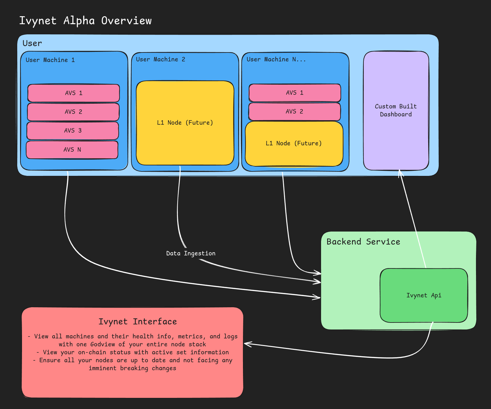

# Introduction

IvyNet is designed to simplify devops, compliance, and business development activities for node operators, allowing them to focus on managing their hardware, virtual environments, and delegated stake while retaining full control of the entire process.

<!-- **TODO: More formal diagram - placeholder** -->

## Client

The client consists of a shared suite of tools for node operators to manage their operations efficiently across deployments while retaining control. Key features will include:

- **Metrics Monitoring**: Continuously monitor system, performance, and health metrics of your nodes to ensure optimal productivity across deployments.
- **Network Adherance**: Keep your systems up to date and ensure your nodes remain in the active sets.
- **Logging**: Collect logs directly from your running services and store them in a database for easy querying via the interface or API.

The client operates as a daemon on all deployed machines, with a command line interface for user interactions.

## User Interface

The user interface is an easy to use webpage that provides actionable insights to your nodes deployments. Features will include:

- **Metrics History**:  Access detailed historical metrics and data to analyze performance and generate operational, compliance, and business development reports.
- **Enhanced Metrics**: Benefit from network-specific inputs, data, and benchmarks to improve quality assurance and maintain competitiveness.
- **AI Diagnoses**: Use IvyNet's AI-powered diagnostics to identify issues in your nodes and receive actionable error-handling suggestions for quick resolution.
- **Organization Management**: Assign roles and manage access permissions for members of your organization.
<!-- **TODO: Picture of mock interface?** -->

IvyNet is built to make node operators' lives easier by offering as much information as possible to the operator.

## API

Want to use your custom dashboards instead of our own? Don't worry, we've got an API!

## Alpha Codebase Notes

An update on where Ivynet is at, where we're going, and what we want your feedback on!

### Where we're at

**Ivynet Client:** Previously, the IvyNet client assumed that users were running AVSs across multiple virtualized environments for security, management ease, etc.
However, since AVS operators aren’t yet compensated, many are running multiple AVSs on a single bare-metal server. As such, we've now built for that, and assume multiple containers might be on one server, baremetal or otherwise.

**API and Interface:** Our primary focus has been on gathering metrics, logs, and system information from your node, with less emphasis on AVS discovery.

### Where we're going

**Ivynet Client:** For the near term, we’ll focus more on observability features rather than new deployments, as most operators are successfully building out their own AVS instances.

**Interface and API:** Our next near-term release is metrics history (and data scaping endpoints to support that). In the longer term future, we'll enhancing AVS discoverability, statistics, and introducing an AI Ops tool to diagnose issues directly from your logs and metrics.

### Feedback Wanted

If you’re reading this, you’re likely already in a Telegram group with us. But if you’re not, feel free to contact us [here on telegram](https://t.me/soho_dot) to share feature requests or feedback!

Here’s what we’d love to know:

- How easy is it to use the various parts of IvyNet (Client, API, Interface)?
- Are there usability improvements we could make to any part of IvyNet?
- Are there any features we don’t yet offer that would make a measurable improvement to your experience as an operator?
- Any other feedback you’d like to share!
