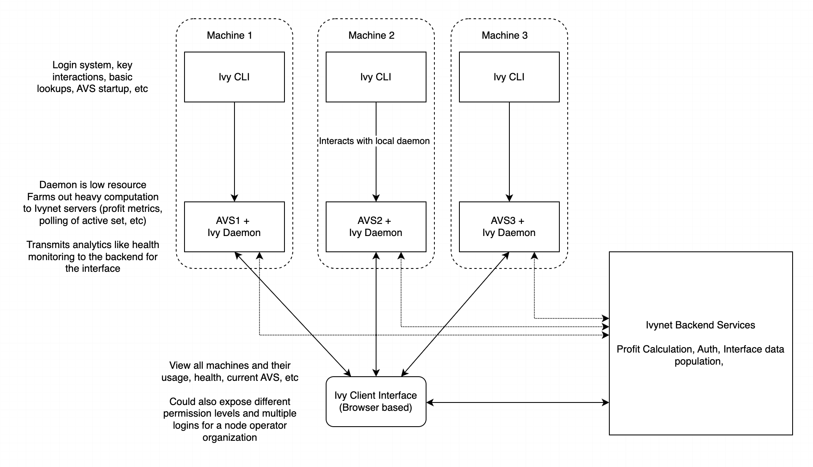

# Introduction

IvyNet is designed to simplify monitoring, deployment, and profitability operations for node operators, allowing them to focus on managing their hardware, virtual environments, and delegated stake while retaining full control of the entire process.

<!-- **TODO: More formal diagram - placeholder** -->

## Client

The client consists offers a suite of tools for node operators to manage their operations efficiently while retaining control. Key features include:

- **Automated Deployments and Updates**: Streamline the deployment process and ensure your systems are always up-to-date.
- **Key Management**: Build and encrypt ECDSA and BLS keys for your nodes. Keys are never passed beyond the environment they're built in.
- **Metrics Monitoring**: Monitor the health of your nodes continuously to ensure optimal performance and quickly address any errors that pop up.
- **Logging**: Logs are taken straight from the services you have running and put into a database for easy querying from the interface or our API.

The client operates as a daemon on all deployed machines, with a command line interface for user interactions.

## User Interface

The user interface is an easy to use webpage that gives a complete overview of your deployed and idle nodes. Features include:

- **Metrics Monitoring and History**: Access detailed metrics and historical data to analyze the performance of your nodes over time.
- **AVS Overview**: View all available AVS options and their deployment requirements tailored to your delegated stake. Look for new nodes to run on your idle hardware, or gather requirements for new deployments.
- **Profitability Metrics**: Analyze historical and projected profitability metrics to optimize profitability to make sure you're maximizing your return on compute.
- **AI Diagnoses**: Use a helpful Ivynet AI to diagnose the problems in your nodes

<!-- **TODO: Picture of mock interface?** -->

IvyNet is built to make node operator's lives easier by offering as much information as possible to the operator.

## API

Want to use your custom dashboards instead of our own? Don't worry, we've got an API!
